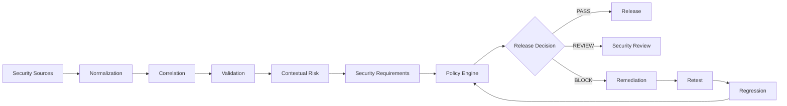
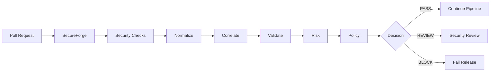

# 🛡️ SecureForge — Continuous Security Verification & Release Gate

<p align="center">
  <strong>Find → Validate → Prioritize → Remediate → Retest → Prevent Recurrence</strong>
</p>

<p align="center">
  A practical security verification and release-gating platform for modern web and API applications.
</p>

<p align="center">
  
  
  
  
  
  
  
</p>

---

## 🎯 The Security Question

> **Is this application release secure enough to ship?**

SecureForge is designed to answer that question using **security evidence, validation, contextual risk, security requirements, and explicit release policies**.

Modern applications are rarely assessed with a single security tool. SAST, SCA, DAST, API testing, secret scanning, container scanning, IaC scanning, infrastructure assessment, and manual penetration testing can all produce valuable evidence.

The challenge is turning that fragmented evidence into a **clear, defensible security decision**.

SecureForge is designed to provide that decision layer.

```text
Security Evidence
       ↓
   Normalize
       ↓
   Correlate
       ↓
   Validate
       ↓
  Assess Risk
       ↓
Map Requirements
       ↓
  Apply Policy
       ↓
PASS / REVIEW / BLOCK
       ↓
   Remediate
       ↓
    Retest
       ↓
Prevent Recurrence
```

## 🧩 What SecureForge Is

SecureForge is a **cybersecurity / Application Security / DevSecOps platform** designed for continuous security verification of web and API applications.

It is designed to:

* Collect security evidence from multiple sources
* Normalize different finding formats
* Correlate duplicate and related findings
* Preserve supporting evidence
* Validate important vulnerabilities
* Map findings to CWE and OWASP classifications
* Map vulnerabilities to security requirements
* Evaluate contextual risk
* Apply configurable security policies
* Produce `PASS`, `REVIEW`, or `BLOCK` decisions
* Generate security reports
* Support remediation and retesting
* Convert important vulnerabilities into regression tests
* Integrate security verification into CI/CD

### The Core Idea

SecureForge is **not another scanner**.

It sits around existing security capabilities and answers the questions that individual tools often cannot answer alone:

```text
"What did we find?"
        ↓
"Are these findings actually the same issue?"
        ↓
"Which findings are confirmed?"
        ↓
"How important are they in this application?"
        ↓
"Which security requirements are violated?"
        ↓
"Should this release ship?"
        ↓
"Was the vulnerability actually fixed?"
        ↓
"Can it come back?"
```

## 🚫 What SecureForge Is Not

SecureForge is deliberately focused.

It is **not** intended to replace:

* Burp Suite
* Nessus
* Nmap
* SAST platforms
* SCA platforms
* DAST platforms
* Secret scanners
* Container scanners
* IaC scanners
* Wireshark
* Metasploit

It is also not intended to become:

* A SIEM
* A SOC platform
* A complete enterprise vulnerability-management suite
* A cloud-security platform
* A generic vulnerability scanner
* A massive SaaS platform
* An attack-path platform
* An AI security chatbot

Instead, SecureForge focuses on the layer connecting:

**security evidence → validation → risk → requirements → policy → release decision → retesting → regression prevention**

## 🏗️ How It Works



### 1. Discover

Security evidence is collected from configured sources.

Examples:

* SAST
* SCA
* Secret scanners
* API security testing
* DAST
* Container scanners
* IaC scanners
* Nmap
* Nessus
* Burp Suite
* Manual validation

### 2. Normalize

Different tools produce different schemas.

SecureForge converts their outputs into a common finding model so that downstream processing does not depend on one particular scanner.

### 3. Correlate

Multiple tools may report the same underlying vulnerability.

SecureForge can combine related evidence into one logical finding instead of presenting several duplicates.

### 4. Validate

Important findings can be investigated and validated using available evidence and controlled security testing.

### 5. Prioritize

Findings are evaluated using more than severity alone.

Relevant context can include:

* Confidence
* Asset importance
* Internet exposure
* Authentication requirements
* Sensitive data
* Exploit evidence
* Environment
* Security requirements

### 6. Apply Policy

The policy engine converts security conditions into a release decision.

```text
                 ┌──────────────┐
                 │ Security     │
                 │ Evidence     │
                 └──────┬───────┘
                        ↓
                 ┌──────────────┐
                 │ Risk +       │
                 │ Requirements │
                 └──────┬───────┘
                        ↓
                 ┌──────────────┐
                 │ Policy       │
                 │ Engine       │
                 └──────┬───────┘
                        ↓
              ┌─────────┼─────────┐
              ↓         ↓         ↓
            PASS      REVIEW     BLOCK
```

### 7. Remediate and Retest

A release blocked by a verified vulnerability moves through remediation and retesting.

### 8. Prevent Recurrence

Important vulnerabilities can become regression tests.

That turns individual security failures into permanent security checks.

## 🧪 SecureCommerce

SecureForge uses **SecureCommerce**, a deliberately vulnerable web/API application, as its controlled verification target.

SecureCommerce is designed to resemble a small but realistic application rather than a collection of disconnected vulnerability demonstrations.

### Application Features

SecureCommerce can include:

| Area           | Example Functionality                 |
| -------------- | ------------------------------------- |
| Identity       | Registration, login, sessions         |
| Users          | Profiles and account data             |
| Authorization  | User and administrative roles         |
| Products       | Product browsing and management       |
| Cart           | Shopping-cart operations              |
| Orders         | Order creation and retrieval          |
| Administration | Administrative functionality          |
| API            | REST endpoints                        |
| Database       | Application data storage              |
| Files          | Controlled file-upload functionality  |
| Integrations   | External-service interaction          |
| Sensitive Data | Controlled sensitive application data |

### Why SecureCommerce Exists

SecureCommerce provides a controlled environment for demonstrating the complete SecureForge lifecycle:

```text
Vulnerable Release
       ↓
Security Testing
       ↓
    Findings
       ↓
  Normalization
       ↓
  Correlation
       ↓
  Validation
       ↓
Risk Evaluation
       ↓
     Policy
       ↓
     BLOCK
       ↓
   Remediation
       ↓
    Retest
       ↓
   Regression
       ↓
      PASS
```

## 🔐 Security Scenarios

SecureCommerce is designed to contain controlled vulnerabilities representing common web, API, application, container, and infrastructure security problems.

### Authentication and Session Security

Potential scenarios include:

* Weak authentication controls
* Insecure session handling
* Authentication weaknesses
* Missing security controls

### Authorization

Potential scenarios include:

* IDOR
* BOLA
* Broken function-level authorization
* Privilege boundary failures
* Unauthorized resource access

### Injection

Potential scenarios include:

* SQL injection
* Unsafe input handling
* Injection through API parameters

### Cross-Site Scripting

Potential scenarios include:

* Reflected XSS
* Stored XSS
* Unsafe output handling

### API Security

Potential scenarios include:

* Missing authentication
* BOLA
* Broken function-level authorization
* Excessive data exposure
* Weak input validation
* Security misconfiguration
* Missing rate/resource controls

### SSRF

Where practical, SecureCommerce can demonstrate controlled server-side request forgery involving unsafe server-side requests.

### File Security

Potential scenarios include:

* Insecure file uploads
* Weak file validation
* Unsafe file processing
* Insecure storage

### Dependency Security

A deliberately vulnerable dependency can be introduced so that SCA evidence can be detected, tracked, remediated, and retested.

### Secret Exposure

A deliberately fake secret or API key can be included for controlled secret-scanning demonstrations.

### Container Security

Controlled container weaknesses can include:

* Running as root
* Vulnerable packages
* Insecure configuration
* Unnecessary exposed ports

### Infrastructure as Code

Terraform configurations can demonstrate issues such as:

* Public exposure
* Permissive network rules
* Insecure storage
* Excessive permissions

### Infrastructure Exposure

Controlled infrastructure assessment can demonstrate:

* Unexpected services
* Exposed ports
* Service versions
* Infrastructure vulnerabilities

## 📚 Security Standards

SecureForge is designed to use established security standards and vulnerability taxonomies.

### OWASP Top 10

Application findings can be mapped to relevant OWASP Top 10 categories.

### OWASP API Security Top 10

API findings can be mapped to relevant OWASP API Security Top 10 categories.

### OWASP ASVS 5.0

Selected security requirements can be mapped to OWASP ASVS 5.0.

> **Important:** SecureForge does not claim complete ASVS compliance. Only requirements that are explicitly implemented, tested, and documented should be represented as verified.

### CWE

Common Weakness Enumeration provides a consistent vulnerability classification layer.

Examples:

```text
CWE-79    Cross-Site Scripting
CWE-89    SQL Injection
CWE-639   Authorization Bypass Through User-Controlled Key
```

### CVSS

CVSS can be used where appropriate to communicate technical severity.

SecureForge does not treat severity as the sole determinant of a release decision.

## 📋 Security Requirements

SecureForge uses explicit internal security requirements to connect findings with expected security behavior.

Example requirement identifiers:

```text
SF-AUTH-001
SF-AUTHZ-001
SF-AUTHZ-002
SF-API-001
SF-API-002
SF-INPUT-001
SF-SECRET-001
SF-DEP-001
SF-CONTAINER-001
SF-IAC-001
SF-TRANSPORT-001
SF-REG-001
```

This allows a finding to communicate more than:

> “A vulnerability was detected.”

It can communicate:

> “This verified vulnerability violates security requirement `SF-AUTHZ-001`.”

## 🧩 Finding Model

Every security source can represent findings differently.

SecureForge uses a normalized model containing information such as:

| Field                | Purpose                       |
| -------------------- | ----------------------------- |
| Finding ID           | Unique SecureForge identifier |
| Title                | Human-readable vulnerability  |
| Source               | Originating security source   |
| Asset                | Affected asset                |
| Application          | Affected application          |
| Endpoint             | Affected endpoint             |
| Parameter            | Relevant parameter            |
| CWE                  | Weakness classification       |
| OWASP Mapping        | OWASP classification          |
| Security Requirement | Violated requirement          |
| Severity             | Technical severity            |
| Confidence           | Confidence level              |
| Evidence             | Supporting evidence           |
| Description          | What was discovered           |
| Impact               | Security consequence          |
| Remediation          | Recommended correction        |
| Status               | Lifecycle state               |
| Validation Status    | Validation state              |
| First Seen           | Initial discovery             |
| Last Seen            | Most recent observation       |
| Regression Test      | Associated regression check   |

### Example

```text
Finding ID:          SF-0012
Title:               Broken Object Level Authorization
Source:              API Security Testing
Asset:               SecureCommerce
Endpoint:            GET /api/orders/{id}
CWE:                 CWE-639
OWASP Mapping:       API1
Requirement:         SF-AUTHZ-001
Severity:            High
Confidence:          Confirmed
Evidence:            User A accessed User B's order
Regression Test:     BOLA-001
```

## 🔄 Normalization

Different security tools may report the same issue using completely different data structures.

For example:

```text
SAST
 ├── File
 ├── Line
 └── Code Evidence

DAST
 ├── Endpoint
 ├── Parameter
 └── HTTP Evidence

Burp Suite
 ├── Request
 ├── Response
 └── Manual Validation
```

SecureForge can transform these representations into a common finding structure.

This creates a consistent input for:

* Correlation
* Validation
* Risk evaluation
* Policy decisions
* Reporting
* Regression tracking

## 🔗 Correlation

Multiple sources may identify the same underlying vulnerability.

Example:

```text
SAST
 └── Possible SQL Injection

DAST
 └── Possible SQL Injection

Burp Suite
 └── Confirmed SQL Injection
```

SecureForge can correlate this evidence into:

```text
SF-00XX — SQL Injection

Evidence:
├── SAST
├── DAST
└── Burp Suite validation
```

### Why Correlation Matters

Correlation can:

* Reduce duplicate findings
* Preserve multi-source evidence
* Improve confidence
* Identify stronger validation
* Simplify remediation tracking
* Improve report quality
* Support clearer release decisions

## ⚖️ Contextual Risk

Technical severity is important, but it does not always describe the complete release risk.

SecureForge can consider:

| Context          | Examples                           |
| ---------------- | ---------------------------------- |
| Severity         | Critical / High / Medium / Low     |
| Confidence       | Confirmed / Probable / Suspected   |
| Asset Importance | Critical / Important / Normal      |
| Exposure         | Internet-facing / Internal         |
| Authentication   | Required / Not required            |
| Sensitive Data   | Present / Absent                   |
| Exploit Evidence | Confirmed / Not confirmed          |
| Requirement      | Requirement violated               |
| Environment      | Production / Staging / Development |

The risk methodology is intended to remain **transparent and explainable**.

The purpose is to make the reasoning behind a release decision understandable rather than hiding it behind an opaque score.

## 🚦 Policy Engine

SecureForge uses configurable security policies.

A basic policy can be expressed as:

```yaml
security_gate:
  critical:
    action: block
  high:
    action: block
  medium:
    action: review
  low:
    action: pass
```

Contextual conditions can further refine the policy.

Examples:

```text
Critical finding
    → BLOCK

Confirmed High finding
    → BLOCK

High-confidence authorization failure
    → BLOCK

Open secret requirement involving an exposed secret
    → BLOCK

Medium finding
    → REVIEW

Low finding
    → PASS
```

The policy remains configurable rather than being permanently hard-coded into the security engine.

## 🚥 Release Decision

SecureForge is designed around three primary outcomes.

### PASS

The configured security policy permits the release to proceed.

### REVIEW

The release requires human security review.

### BLOCK

The release violates a configured security policy and should not proceed until the blocking condition is resolved or handled through an explicitly defined process.

```text
                 ┌───────────┐
                 │  Findings │
                 └─────┬─────┘
                       ↓
                 ┌───────────┐
                 │ Risk +    │
                 │ Context   │
                 └─────┬─────┘
                       ↓
                 ┌───────────┐
                 │  Policy   │
                 └─────┬─────┘
                       ↓
             ┌─────────┼─────────┐
             ↓         ↓         ↓
           PASS      REVIEW     BLOCK
```

## 🧪 Verification Profiles

Different stages of development can use different verification depths.

### Quick

Fast feedback for common security checks.

```text
SAST
Secrets
SCA
```

### Standard

Broader application verification.

```text
Quick
+
API Security
DAST
Container Security
```

### Full

Broader application, infrastructure, and configuration verification.

```text
Standard
+
IaC Security
Nessus
Nmap
Manual Validation
```

## 🔌 Security Integrations

SecureForge is designed to integrate with mature security tooling rather than reimplement its functionality.

### Application Security

* SAST
* SCA
* Secret scanners
* OpenAPI/API security testing
* DAST

### Infrastructure and Configuration

* Container scanners
* IaC scanners
* Nessus
* Nmap

### Manual and Expert Validation

* Burp Suite
* Wireshark
* Metasploit
* Manual penetration testing

## 🕷️ Burp Suite

Burp Suite can be used for controlled manual validation of application and API findings.

Examples include:

* Authentication testing
* Authorization testing
* Parameter manipulation
* IDOR/BOLA validation
* Request modification
* Session testing
* API behavior analysis
* Injection validation

SecureForge consumes relevant evidence rather than attempting to recreate Burp Suite.

## 🌐 Nmap and Nessus

### Nmap

Nmap can provide evidence about:

* Exposed ports
* Unexpected services
* Service versions
* Attack surface

### Nessus

Nessus can provide evidence about:

* Known vulnerabilities
* Vulnerable software
* Configuration weaknesses
* Infrastructure security issues

Their findings can be normalized into the SecureForge model.

## 📡 Wireshark

Wireshark can provide packet-level evidence where network validation is relevant.

Examples include:

* Transport-security validation
* Protocol behavior
* Unexpected communication
* Application traffic analysis

SecureForge does not replace Wireshark's packet-analysis capabilities.

## 💥 Metasploit

Metasploit can be used for controlled validation of selected vulnerabilities within the authorized lab environment.

The objective is **evidence-based validation**, not indiscriminate exploitation.

## 🔄 CI/CD Security Gate

SecureForge is designed to integrate directly into CI/CD workflows.



### Example

```text
Pull Request
     ↓
SecureForge
     ↓
Security Checks
     ↓
 Normalize
     ↓
 Correlate
     ↓
 Validate
     ↓
Risk Evaluation
     ↓
Policy Evaluation
     ↓
PASS / REVIEW / BLOCK
```

A `BLOCK` decision can cause the CI/CD workflow to fail and prevent the release from continuing.

## 🛠️ Remediation

Security verification does not end when a vulnerability is discovered.

The intended lifecycle is:

```text
Vulnerable
    ↓
Detected
    ↓
Validated
    ↓
BLOCK
    ↓
Remediation
    ↓
Retest
    ↓
Regression
    ↓
PASS
```

### Developer Feedback

A useful finding should explain:

* What happened
* Where it happened
* Why it matters
* How it was validated
* How it can be fixed
* How the fix will be verified

Example:

```text
BOLA detected:

GET /api/orders/{id}

User A was able to retrieve an order belonging to User B.

Impact:
Unauthorized access to another user's order data.

Remediation:
Enforce server-side authorization against the authenticated
user and requested object before returning the resource.

Verification:
Repeat the cross-user access test after remediation.
```

## 🔁 Regression Security

Important confirmed vulnerabilities can become repeatable regression tests.

Examples:

```text
BOLA-001
SQLI-001
XSS-001
AUTHZ-001
SECRET-001
MISCONFIG-001
```

This creates a long-term security feedback loop:

```text
Vulnerability
      ↓
  Validation
      ↓
 Remediation
      ↓
Regression Test
      ↓
Future Release
      ↓
Automatic Verification
```

The objective is to prevent a previously fixed security weakness from silently returning.

## 📊 Security Reports

SecureForge is designed to produce both machine-readable and human-readable reports.

```text
security-report.json
security-report.html
```

Reports can contain:

| Report Data         | Purpose                            |
| ------------------- | ---------------------------------- |
| Release ID          | Identifies the release             |
| Commit SHA          | Identifies the source version      |
| Application Version | Identifies the application build   |
| Environment         | Development / staging / production |
| Profile             | Quick / standard / full            |
| Tools               | Security sources used              |
| Findings            | Discovered issues                  |
| Correlation         | Related evidence                   |
| Validation          | Confirmed findings                 |
| Risk                | Contextual assessment              |
| Policy              | Release-gate evaluation            |
| Exceptions          | Approved exceptions                |
| Remediation         | Current fix status                 |
| Regression          | Regression results                 |
| Decision            | PASS / REVIEW / BLOCK              |
| Timestamp           | Assessment time                    |

## 🖥️ CLI

SecureForge is designed around a CLI-driven workflow.

### Scan

```bash
secureforge scan
```

### Select a Profile

```bash
secureforge scan --profile quick
secureforge scan --profile standard
secureforge scan --profile full
```

### Generate a Report

```bash
secureforge report
```

### Check Policy

```bash
secureforge policy check
```

### Run Regression Tests

```bash
secureforge regression
```

### Validate a Finding

```bash
secureforge validate
```

## 📁 Project Structure

```text
SecureForge/
│
├── README.md
│
├── secureforge/
│   ├── cli/
│   │
│   ├── core/
│   │   ├── findings/
│   │   ├── normalization/
│   │   ├── correlation/
│   │   ├── risk/
│   │   ├── policy/
│   │   └── requirements/
│   │
│   ├── integrations/
│   │   ├── sast/
│   │   ├── sca/
│   │   ├── secrets/
│   │   ├── api/
│   │   ├── dast/
│   │   ├── container/
│   │   ├── iac/
│   │   ├── nessus/
│   │   ├── nmap/
│   │   └── manual/
│   │
│   ├── validation/
│   ├── regression/
│   ├── reporting/
│   └── config/
│
├── tests/
│
├── policies/
├── requirements/
│
├── vulnerable-app/
│   └── securecommerce/
│
├── lab/
├── reports/
│
├── docs/
│   ├── architecture/
│   ├── threat-model/
│   ├── methodology/
│   └── security-requirements/
│
└── .github/
    └── workflows/
```

## 🧰 Technology Stack

### Application

* Python
* Flask or FastAPI
* REST
* OpenAPI
* SQLite or PostgreSQL

### Infrastructure

* Linux
* Docker
* Terraform
* Git
* GitHub Actions

### Security Tooling

* Burp Suite
* Nmap
* Nessus
* Wireshark
* Metasploit
* SAST tools
* SCA tools
* Secret scanners
* DAST tools
* Container scanners
* IaC scanners

## 🧪 Testing Strategy

SecureForge is designed to be tested at multiple levels.

### Unit Testing

Individual components can be tested independently:

* Finding parsing
* Normalization
* Correlation
* Risk evaluation
* Policy evaluation
* Requirement mapping

### Integration Testing

Integration testing covers interactions between:

* Security-tool adapters
* Finding processing
* Core security logic
* Policy engine
* Reporting
* CI/CD

### Security Testing

SecureCommerce provides the controlled target for security testing.

Examples include:

* SQL injection
* BOLA
* XSS
* Authorization failures
* Secret exposure
* Dependency vulnerabilities
* Container weaknesses
* IaC weaknesses

### Regression Testing

Regression tests verify that previously fixed vulnerabilities do not return.

## 🧾 Evidence and Reproducibility

Security decisions should be backed by evidence.

SecureForge is designed to preserve:

* Scanner output
* Validation evidence
* Finding metadata
* Requirement mappings
* Risk context
* Policy decisions
* Retest results
* Regression results

The objective is to make every important security decision **explainable, traceable, and reproducible** within the controlled environment.

## 📈 Security Metrics

Useful measurements can include:

* Findings by severity
* Findings by source
* Confirmed versus unconfirmed findings
* Correlated findings
* Security requirements violated
* Releases blocked
* Releases requiring review
* Mean time to remediation
* Retest success rate
* Regression failures
* Release decisions over time

> **No benchmark results, vulnerability counts, accuracy percentages, or performance claims should be fabricated. Metrics should represent actual observed results.**

## 🗺️ Roadmap

SecureForge is designed to evolve from a core security-verification engine into a broader release-security workflow.

### Foundation

* Core project structure
* Configuration
* Finding model
* Security requirements
* CLI foundation
* Logging
* Error handling

### Evidence Processing

* Finding ingestion
* Normalization
* Evidence preservation
* Source adapters
* Finding lifecycle

### Security Intelligence

* Correlation
* Confidence
* CWE mapping
* OWASP mapping
* Security requirement mapping
* Contextual risk

### Release Security

* Policy engine
* PASS / REVIEW / BLOCK
* Verification profiles
* Security reports
* CI/CD integration

### Validation

* SecureCommerce
* Controlled vulnerabilities
* API testing
* DAST
* Manual validation
* Burp Suite workflows
* Nmap workflows
* Nessus workflows

### DevSecOps

* Remediation workflow
* Retesting
* Regression tests
* GitHub Actions
* Release gating
* Developer feedback

### Advanced Verification

* Container security
* IaC security
* Broader evidence correlation
* Network-level validation
* Controlled Metasploit validation
* Expanded security requirements

## 🎬 End-to-End Demonstration

A complete SecureForge demonstration can show the transformation of a vulnerable release into a verified release.

### Vulnerable Release

SecureCommerce contains controlled weaknesses such as:

```text
SQL Injection
BOLA
Vulnerable Dependency
Fake Secret
Root Container
```

Security tools produce evidence.

SecureForge processes the evidence:

```text
Collect
  ↓
Normalize
  ↓
Correlate
  ↓
Map
  ↓
Validate
  ↓
Assess Risk
  ↓
Apply Policy
  ↓
BLOCK
```

### Remediation

The security weaknesses are addressed:

```text
SQL Injection      → Fixed
BOLA               → Fixed
Dependency         → Updated
Fake Secret        → Removed
Root Container     → Hardened
```

### Retest and Regression

The release is tested again.

Previously validated vulnerabilities are checked through regression tests.

```text
Retest
   ↓
Regression
   ↓
No Blocking Findings
   ↓
Policy Evaluation
   ↓
PASS
```

This demonstrates the complete security lifecycle rather than stopping at vulnerability discovery.

## 📐 Design Principles

SecureForge follows several core principles.

### Evidence Over Assumption

Security decisions should be supported by evidence whenever possible.

### Validation Over Blind Trust

A scanner finding should not automatically be treated as a confirmed vulnerability.

### Context Over Severity Alone

Technical severity matters, but application context also matters.

### Explainable Decisions

A `PASS`, `REVIEW`, or `BLOCK` decision should have an understandable reason.

### Fix Verification

A vulnerability should not be considered resolved merely because code changed.

### Regression Prevention

Important security failures should become repeatable security tests where practical.

### Reuse Mature Security Tools

SecureForge should orchestrate and consume evidence from established tools rather than unnecessarily rebuilding them.

### Reproducibility

Security results should be reproducible in the controlled environment.

## 🚧 Scope Boundaries

SecureForge deliberately remains focused on:

```text
Security Evidence
       ↓
Normalization
       ↓
Correlation
       ↓
Validation
       ↓
Contextual Risk
       ↓
Security Requirements
       ↓
Policy
       ↓
Release Decision
       ↓
Retesting
       ↓
Regression Prevention
```

It does not attempt to become:

```text
A SIEM
A SOC platform
A complete enterprise vulnerability-management suite
A cloud-security platform
A universal scanner
A DAST replacement
A SAST replacement
A Nessus replacement
A Burp Suite replacement
A Metasploit replacement
A generic attack framework
A massive SaaS platform
An AI security chatbot
```

## 🔒 Authorized Use

SecureForge is intended for:

* Authorized security testing
* Controlled security laboratories
* Application-security research
* Security engineering
* DevSecOps experimentation
* Educational use

Only assess applications, APIs, infrastructure, and systems that you own or have explicit authorization to test.

The deliberately vulnerable SecureCommerce application provides a controlled environment for practicing the security-verification workflows demonstrated by SecureForge.

## 📄 License

This project is intended for educational, research, and authorized security-engineering use.

See the repository license for the applicable terms.
